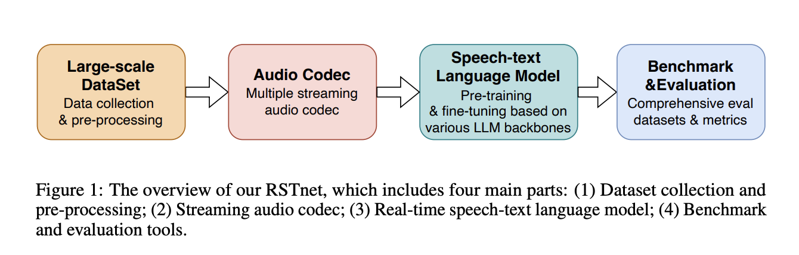

</img>


# RSTnet: Real-time Speech-Text Foundation Model Toolkit (wip)
Building a real-time speech-text foundation model capable of understanding and generating speech has garnered significant attention. Notable examples of such models include ChatGPT-4o and Moshi. However, challenges in training these models continue to persist in the research community. We introduce RSTnet, a new open-source platform designed for developing real-time speech-text foundation models. RSTnet offers a comprehensive framework for data processing, pre-training, and fine-tuning, aimed at helping researchers build their real-time speech-text models efficiently. It builds upon previous works, such as the real-time spoken dialogue model (Moshi) and the universal audio generation model (UniAudio). RSTnet consists of following key components: (1) Data preparation; (2) streaming audio codec models; (3) speech-text foundation models; (4) Benchmark and Evaluation.

## News
- [x] 2024.10.7. We release the first version of RSTnet.

## Make Contributions
The project is still ongoing. If you have interest about RSTnet, welcome to make contribution. You can consider:
- [1] Propose issue or PR to solve the bugs
- [2] Propose more idea about Data collection, streaming codec, and speech-text foundation model
- [3] Join us as an author of this project. (Contact me by dcyang@se.cuhk.edu.hk)


## Install

```
conda create -n RSTnet python=3.12
conda activate RSTnet
pip install torch torchvision torchaudio --index-url https://download.pytorch.org/whl/cu121
pip install tqdm
pip install librosa==0.9.1
pip install matplotlib
pip install omegaconf 
pip install einops
pip install vector_quantize_pytorch
pip install tensorboard
pip install deepspeed
pip install peft
```

## Technical report
You can find our technical report from https://github.com/yangdongchao/RSTnet/blob/main/RSTnet.pdf

## DataPipeline
More details will be updated soon. You can refer to DataPipeline part.

## AudioCodec
We plan to support more SOTA streaming audio codec. Now, we have reproduced the MimiCodec.

## Multi-modal LLM
We release the fine-tuning code for moshi now. In the next step, we will release the full recipes about pre-training, post-training. Furthermore, we also consider to add other SOTA speech-text foundation paradigms. 

## Reference
The implements of streaming audio codec and speech-text language models are based on previous codebase:
https://github.com/kyutai-labs/moshi
https://github.com/yangdongchao/UniAudio

## Citations
```bibtex
@techreport{RSTnet,
  title={RSTnet: Real-time Speech-Text Foundation Model Toolkit},
  author={RSTnet team},
  journal={Technical report},
  year={2024}
}
```
```bibtex
@techreport{kyutai2024moshi,
    author = {Alexandre D\'efossez and Laurent Mazar\'e and Manu Orsini and Am\'elie Royer and
			  Patrick P\'erez and Herv\'e J\'egou and Edouard Grave and Neil Zeghidour},
    title = {Moshi: a speech-text foundation model for real-time dialogue},
    institution = {Kyutai},
    year={2024},
    month={September},
    url={http://kyutai.org/Moshi.pdf},
}
```
```
```bibtex
@article{yang2023uniaudio,
  title={UniAudio: An Audio Foundation Model Toward Universal Audio Generation},
  author={Dongchao Yang, Jinchuan Tian, Xu Tan, Rongjie Huang, Songxiang Liu, Xuankai Chang, Jiatong Shi, Sheng Zhao, Jiang Bian, Xixin Wu, Zhou Zhao, Helen Meng},
  journal={arXiv preprint arXiv:2310.00704},
  year={2023}
}
```


